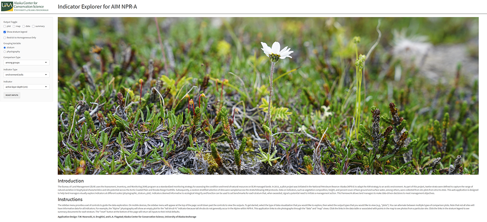

# Indicator Explorer for AIM NPR-A Data

\
 
## About the Project 🌿
This repository provides a set of R and Python scripts to process data from vegetation surveys and to create the 
[Indicator Explorer for AIM NPR-A R Shiny app](https://apps.akconservationscience.org/aim-npra). The data processed includes plot-level data on foliar cover, environment and soils,
and plot photos. 

The primary goal of this project is to use field-based data to create a R Shiny app to be used during Bureau of Land 
Management's AIM NPR-A Benchmarks Workshop held in Fairbanks in spring 2024. The Shiny app serves as a user-friendly 
interface for visualizing, exploring, and analyzing the processed ecological data, making complex datasets accessible to scientists and land managers.

The scripts handle various stages of data preparation, including querying and processing data from the [AKVEG 
Database](https://akveg.uaa.alaska.edu/), creating a classification schema to categorize plots, and processing and integrating plot photos into 
HTML pages. The processed outputs are then integrated into an R Shiny app, where they are used to create maps, 
visualizations, and summary tables.

### Built With 🛠️
This project is built using the following software and packages:

**Python**

* Python 3.9+
  * `os`
  * `pandas`
  * `re`
  * `pathlib`

**R**

* R 4.0.0+ 
  * `tidyverse` packages: `dplyr`, `readr`, `readxl`, `stringr`, `tibble`, `tidyr`, `purrr`
  * `fs`
  * `RPostgres`
  * `DT`
  * `leaflet`
  * `plotly`
  * `RColorBrewer`
  * `shiny`
  * `shinyjs`
  * `shinythemes`
  * `shinyWidgets`

## Getting Started 🚀
Follow these simple steps to run the scripts on your local machine.

### Prerequisites
Before you begin, ensure you have the following:
* **Git**: For cloning the repository.
* **Database credentials**: The AKVEG Database is a 
cloud-based, 
PostgreSQL database that contains standardized vegetation data of more than 34,000 plots in Alaska .
You can request server credentials to access 
the database by [visiting the AKVEG website](https://akveg.uaa.alaska.edu/).
* **R Shiny app inputs**: Alternatively, if you are only interested in reproducing the R Shiny app, download 
  the [Shiny app inputs](https://storage.googleapis.com/accs-public-data/github_aim_npra_data.zip) (ZIP file). After 
  cloning the repository and installing the required R packages, replace the contents of the 'www' folder with the 
  contents of the ZIP file. Doing so will allow you to run the R Shiny app on your local machine.
* **Google Cloud virtual machine**: If you are interested in replicating the R Shiny app on a server, you will need 
  access to a Google Cloud virtual machine (or similar) on which you can install R, R Studio Server, and Shiny Server. 

### Installation

1.  **Clone the repository**:
    Open your terminal or command prompt and clone the project repository to your local machine using Git:
    ```bash
    git clone https://github.com/accs-uaa/aim-npra-benchmarks.git
    ```
    
2.  **Install dependencies**:
    Ensure that you have the programming languages and packages that are listed in [Built With](#built-with-) 
    section installed on your local machine.

## Usage ▶️

1. **Prepare your input files**

Ensure that your database credentials or app inputs are located in a directory on your local computer.

2. **Configure script file paths**

Each R and Python script in this repository includes variables at the top of the script that define input and output 
file paths. You will need to modify these paths to correctly point to the locations on your computer where your 
input files are stored and where you want the processed outputs to be saved.

3. **Execute the processing scripts**

The scripts are numbered to guide you through the correct execution order. Simply run them sequentially, following the numerical order. For example, start with scripts labeled `01_...`, then `02_...`, and so on. Each script performs a specific processing step, ensuring your data is ready for the next stage of the workflow.

4. **View your R Shiny app locally**

Once all the processing scripts have been successfully executed and the necessary data are prepared, you can launch 
and view the R Shiny application. 

* **Using RStudio:** Open the `app.R` file in RStudio. Then, click the "Run App" button located in the top-right corner of the script editor pane. 
* **From an R console:** Navigate your R console to the directory containing the `app.R file`, and then run `shiny::runApp()`.

The Shiny app will automatically open in your default web browser, allowing you to interact with the data and 
explore plot locations, visualizations, and summary tables.

5. **Deploy your R Shiny app**

Follow the instructions in `gcloud_shiny.md` if you would like to set up a virtual machine to serve your R Shiny app.

## Project Information

### License ⚖️
This project is provided under the [GNU General Public License v3.0](https://www.gnu.org/licenses/gpl-3.0.html). It is free to use and modify in part or in whole.

### Contact 📧
* **Project Maintainer**: Amanda Droghini 
* **Email**: adroghini (at) alaska.edu
* **GitHub**: [@adroghini](https://github.com/adroghini)